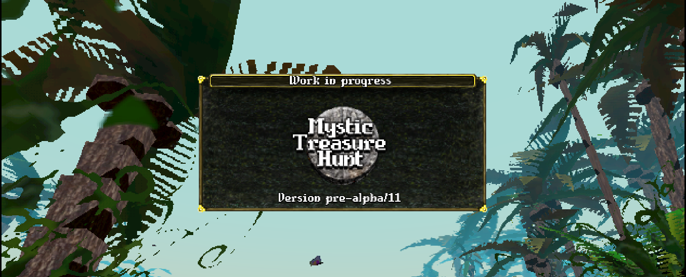
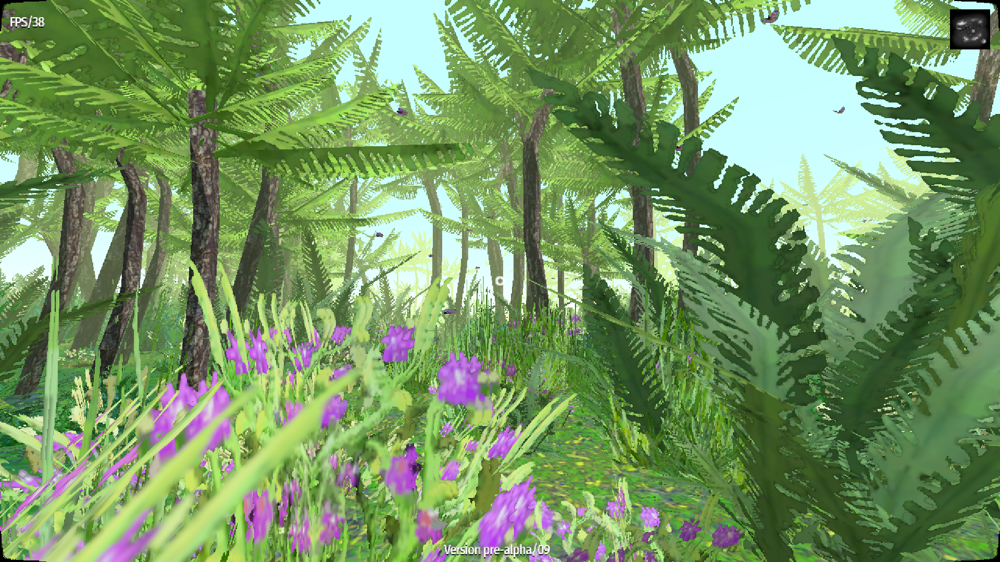
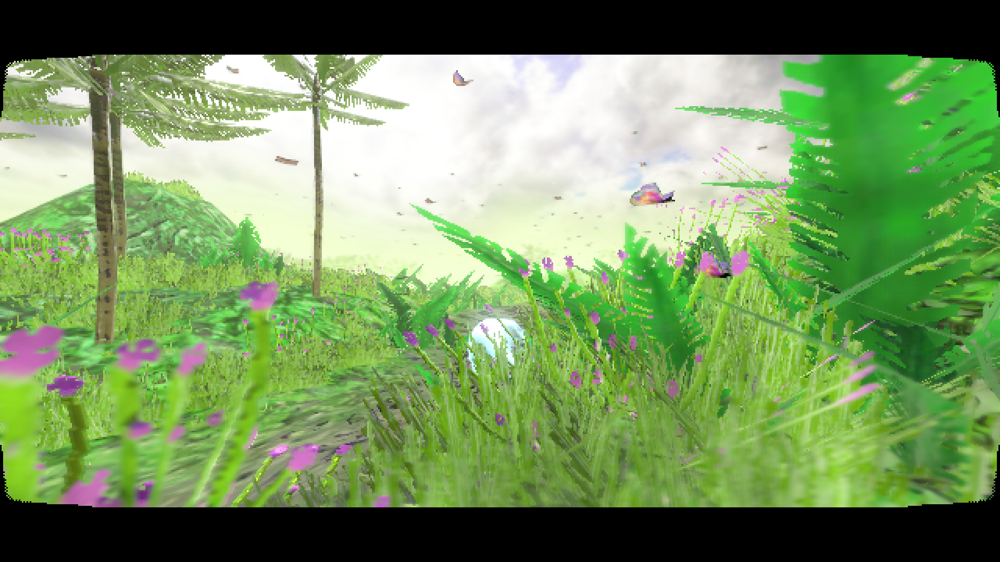
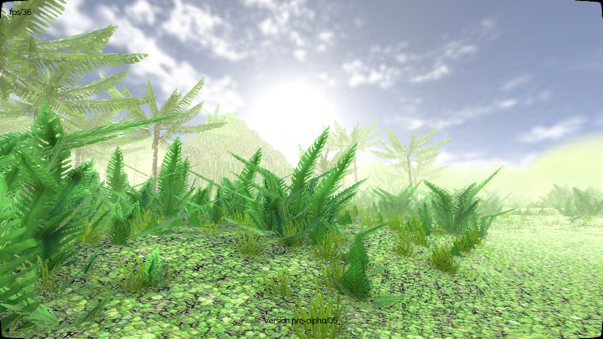
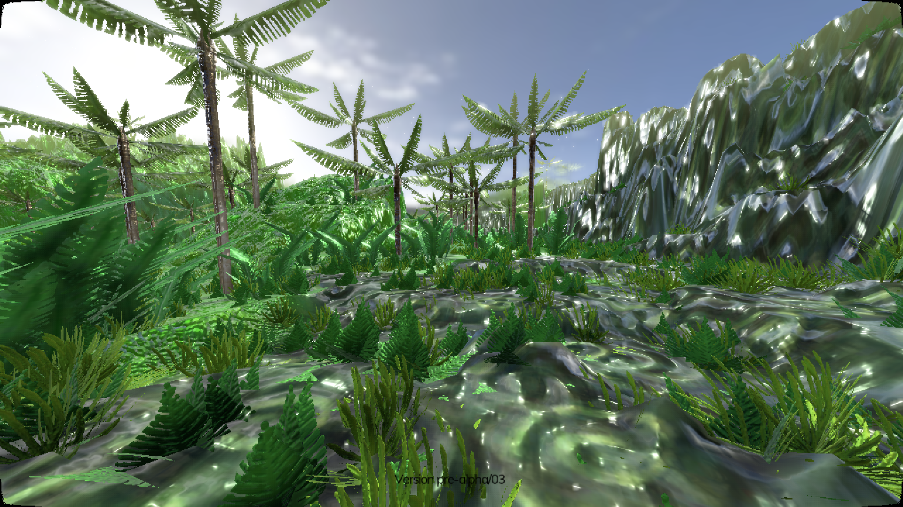
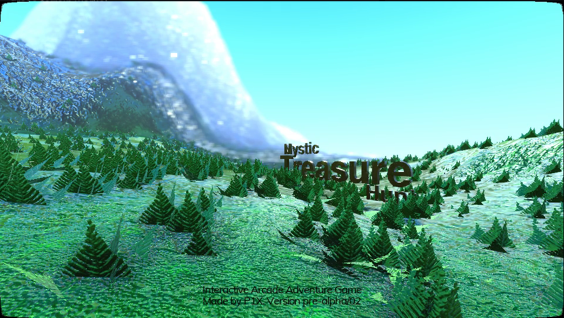
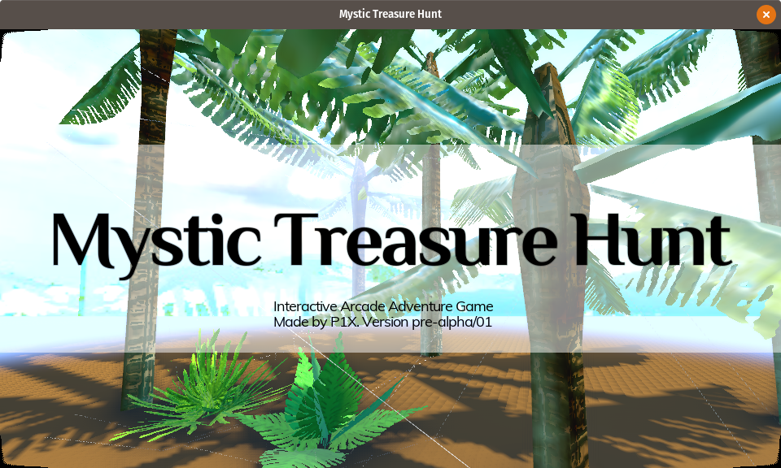

# Mystic Treasure Hunt
Arcade adventure game for PC. Targeted for Arcade Machine with big screen for [our booth at expos](http://p1x.in/events).

## Open Source Engine
Game is made using **Godot Engine 3.1-dev**. To run the project form source code you'll need the [latest Godot Engine build](http://docs.godotengine.org/en/latest/development/compiling/). It will **not work** on 2.1 nor 3.0.

## Technology
Custom made shaders for:
- terrain generated from heightmap
- terrain supports 4 PBR materials
- grass, bushes, palms procedurally generated from featuresmap
- butterflies, (planned) birds
- water, [blog post about water shader](http://krzysztofjankowski.com/blog/water-shader-in-godotengine-3.html)

## Roadmap

The big picture on the project. It's divided into three milestones. A, B and C.

Firstly to get all the tech done. So it can be used to make an game. Also it will be a good base for other games. Most of the work was made during the [The Islands of Shaders project](https://github.com/w84death/the-islands-of-shaders). But there's room for improvements.

Prototype one of them fits in to the second milestone. It ends at Poznan Game Arena where it will be showcased. 

And lastly, based on the feedback and ideas final game will be made, closing last milestone.

### Milestone A: Tech

#### Done

- bigger terrain with mountains
- grass, bush, palms
- PBR for all assets
- movement with fov change (kinda bugged, turned off by default)

#### To-do (priority ordered)

- one terrain settings (heightmap/size) + script that propagates this to all shaders
- birds
- clouds
- easy changing maps
- grass  shader reacts to movement
- good map to discover
- waterfall shader
- buildings materials
- locomotion (probably one-railer)
- portals
- collecting letters (TREASURE) hidden on islands
- lots of "stars" to collect
- ...

### Milestone B: Prototype

#### Done

- intro idea, screenplay, test shoots
- rough idea for the game

#### To-do

- a lot...

### Milestone C: The Game

At last we have a name, right?

## Changelog

### alpha/08

- [change] back to HD ready (1280x720)
- [update] big grass shader changes (scale, height, rotate)
- [new] aim sprite (circle in the center)
- [update] optimizations to all materials
- [removed] all normal/spec/ao/disp textures

### alpha/07

- [change] resolution 800x364
- [new] camera motion blur
- [updated] grass textures

### alpha/06

Lot have changed on the visual side. Basically everything was updated.

- [change] resolution downgrade to 640x290 (2.20:1) to support 60fps
- [updated] grass and terrain materials
- [updated] skybox material
- [updated] terrain is now 2048x2048 (scale x4)
- [updated] thick grass
- [added] butterflies

### alpha/05

Most of the time I worked on look and feel of the assets I've already have. I want to know the direction before making more of them. Also testing lot of heightmaps to get used to making good looking maps.

- [new] Super Panavision 70 aspect ratio (2.20:1 - 800x364)
- [updated] back to 60fps (on nVidia 1050)
- [updated] grass/terrain materials
- [updated] bigger grass models

### alpha/04

Game starts to look good. I'm testing few styles for the final look.

- [ported] water shader
- [update] lighting
- [update] skybox
- [update] bush, palm models
- [updated] terrain textures

### alpha/03

Lot and lot of work with porting all the shaders to work with scaled terrain and new directory tree.

- [updated] terrain/grass shaders
- [new] terrain uses all the PBR textures
- [ported] palms
- [updated] movement, particles works with scaled terrain

### alpha/02

Terrain is visible. First tests of scaled terrain (x4 right now).

- [ported] terrain
- [ported] grass (one type)
- [ported] movement

### alpha/01

Project is empty but all the main files are moved. New directories created.

- [new] proper project structure
- [ported] few models and textures

## Ideas

Until Milestone A will be finished I need to have at last some height level idea. Here I'll be writing all ideas and probably sentence something from them.

### Soul Quest

Player starts in the heavens. As a soul he lands on an island in a mission to find as many artifacts as possible in a restricted timespan. This has a problem of being one player game.

 ### Piradice II

My first successful game was Piradice. And now looking at this awesome tech for rendering islands it feels like the time for a sequel. Probably first thing I do after this arcade game will be created. So more like 2019.

### Pac-man style

There are bad actors on the map. They will chase the player if close by. Player searches for artifacts. There are shrooms in the forest terrain that eaten gives player power to catch enemies. They will retreat.

### Dijkstra

On the island there are distributed T, R, E, A, S, U, R and E letters to collect. Also lot of stars to collect. Stars are just for pleasure and helps aim the map (shows paths). Player main goal is to collect all letters and also in the correct order.  And in the shortest possible time.

hint: word treasure is not the best one as it have doubled R and E letters.

### Brainstorming

What the ~arcade game for expo~ needs to have:

- two player mode - option for one player (ex. sports games)
- one button - all 4 should work as one (no dead buttons)
- understandable without instruction - WYSIWYG no hidden parts, inventory etc 
- colorful content - players and main items must be different than background; bg should be colorful but avoid those main colors
- competitive in nature - fight against or it can be also to get most points together 
- leader board - print flyer score certifivate for each player
- feel of progression - levels instead of points
- leader board 2 - each level gives a code for future continue; that way each player "owns" his status by knowing the code for particular level. 