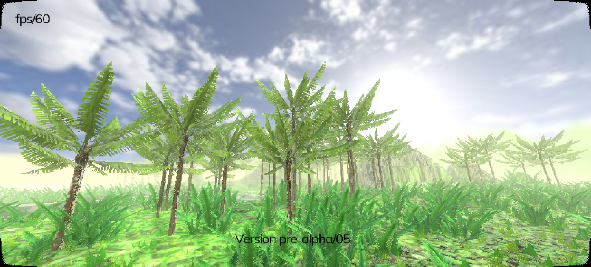

# Mystic Treasure Hunt
Arcade adventure game for PC. Targeted for Arcade Machine with big screen for [our booth at expos](http://p1x.in/events).

## Open Source Engine
Game is made using **Godot Engine 3.1-dev**. To run the project form source code you'll need the [latest Godot Engine build](http://docs.godotengine.org/en/latest/development/compiling/). It will **not work** on 2.1 nor 3.0.

## Technology
Custom made shaders for:
- terrain generated from heightmap
- terrain supports 4 PBR materials
- grass, bushes, palms procedurally generated from featuresmap
- butterflies, (planned) birds
- water, [blog post about water shader](http://krzysztofjankowski.com/blog/water-shader-in-godotengine-3.html)

## Roadmap

The big picture on the project. It's divided into three milestones. A, B and C.

Firstly to get all the tech done. So it can be used to make an game. Also it will be a good base for other games. Most of the work was made during the [The Islands of Shaders project](https://github.com/w84death/the-islands-of-shaders). But there's room for improvements.

Prototype one of them fits in to the second milestone. It ends at Poznan Game Arena where it will be showcased. 

And lastly, based on the feedback and ideas final game will be made, closing last milestone.

### Milestone A: Tech

#### Done

- bigger terrain with mountains
- grass, bush, palms
- PBR for all assets

#### To-do

- butterflies, birds
- clouds
- easy changing maps
- movement with fov change
- motion blur
- good map to discover
- water shader
- buildings materials
- locomotion (probably one-railer)
- portals
- collecting letters (TREASURE) hidden on islands
- lots of "stars" to collect
- ...

### Milestone B: Prototype

#### Done

- intro idea, screenplay, test shoots
- rough idea for the game

#### To-do

- a lot...

### Milestone C: The Game

At last we have a name, right?

## Changelog

### alpha/05

Work in progress..

- [new] Super Panavision 70 aspect ratio (2.20:1 - 800x364)
  
- [updated] back to 60fps (on nVidia 1050)

### alpha/04

Game starts to look good. I'm testing few styles for the final look.

- [ported] water shader
- [update] lighting
- [update] skybox
- [update] bush, palm models
- [updated] terrain textures

### alpha/03

Lot and lot of work with porting all the shaders to work with scaled terrain and new directory tree.

- [updated] terrain/grass shaders
- [new] terrain uses all the PBR textures
- [ported] palms
- [updated] movement, particles works with scaled terrain

### alpha/02

Terrain is visible. First tests of scaled terrain (x4 right now).

- [ported] terrain
- [ported] grass (one type)
- [ported] movement

### alpha/01

Project is empty but all the main files are moved. New directories created.

- [new] proper project structure
- [ported] few models and textures