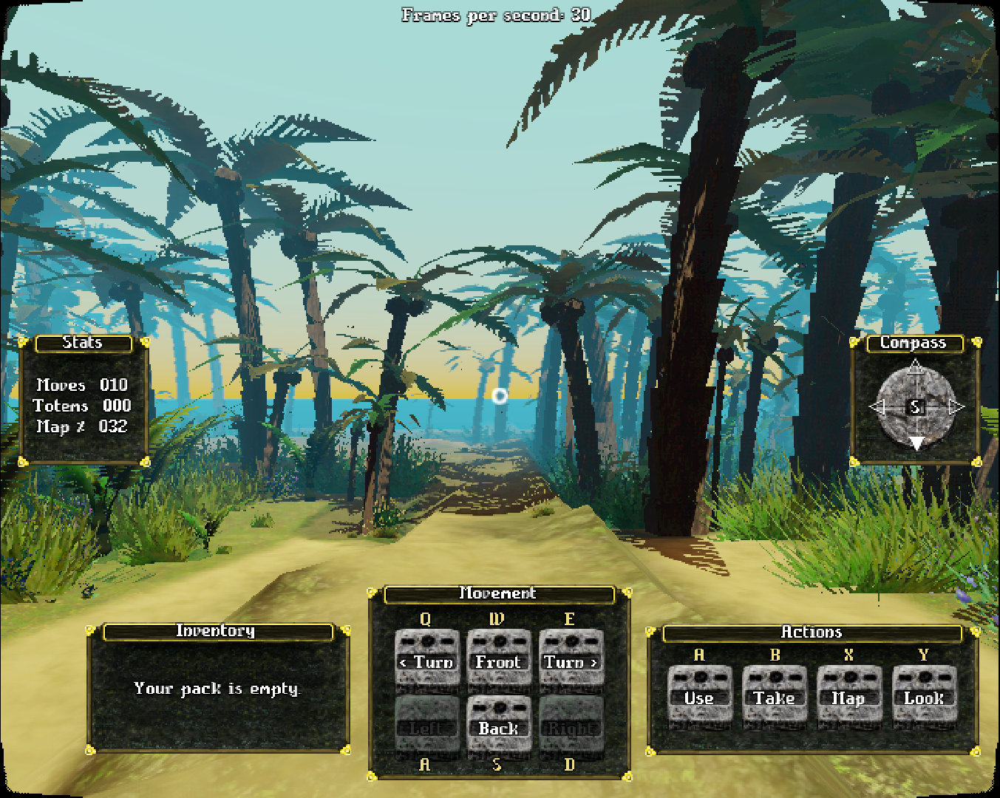
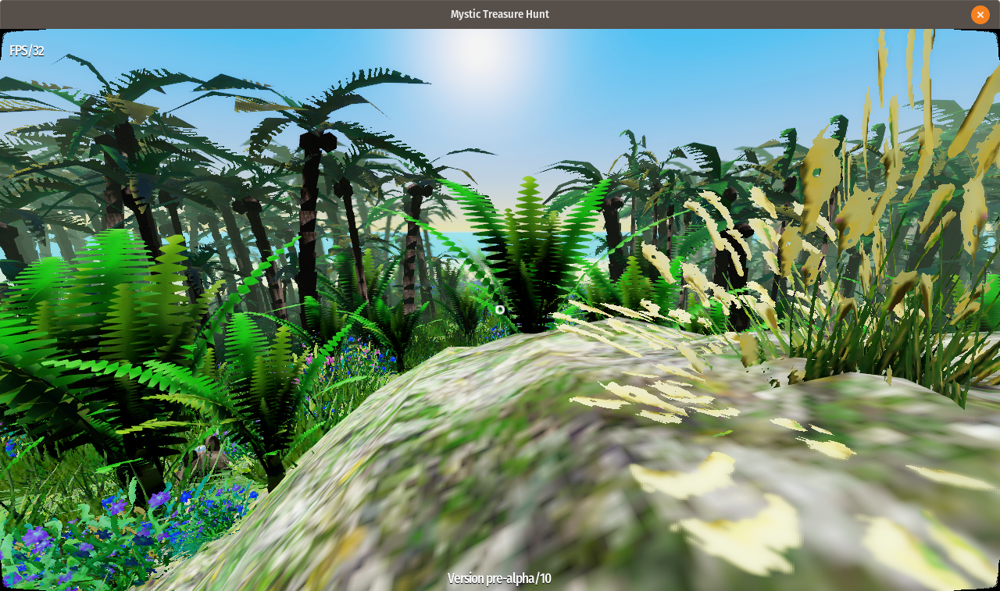

# About Mystic Treasure Hunt
Mystic Treasure Hunt is a first-person action role-playing game with tile-based movement and turn based game mechanics.

## Open Source Engine
Game is made using **Godot Engine 3.1-dev**. To run the project form source code you'll need the [latest Godot Engine build](http://docs.godotengine.org/en/latest/development/compiling/). It will **not work** on 2.1 nor 3.0.

## Technology
Custom made shaders for:
- terrain generated from height-map,
- grass, bushes, palms procedurally generated from features-map, [article about grass shader](https://bits.krzysztofjankowski.com/how-i-grow-with-grass-shader/),
- butterflies,
- water, [article about water shader](http://krzysztofjankowski.com/blog/water-shader-in-godotengine-3.html).

## Roadmap

The big picture on the project. It's divided into three milestones. A, B and C.

Firstly to get all the tech done. So it can be used to make an game. Also it will be a good base for other games. Most of the work was made during the [The Islands of Shaders project](https://github.com/w84death/the-islands-of-shaders). But there's room for improvements.

Prototype one of them fits in to the second milestone. 

And lastly, based on the feedback and ideas final game will be made, closing last milestone.

The game is right now between milestone A and B. There is some game play but it's still not enough for a prototype. Also there is a slightly idea what the game should looks like for the milestone C.

# Specifications

### Map file

Each single terrain file is made of:

- heightmap 2048x2048 px (gray only, 0-255)
- featuresmap 2048x2048 px (RGB)
- pixelmap 64x64 px (1bit - white or black)

Terrain is made of 64x64 tiles, each 32x32px (in above textures). Player can move one tile at a time. This makes one tile 2x2m in "real life" reference. This gives us 128 by 128 meters or 0.015km^2 for each individual terrain files.

### Models

Each model is scaled using this formula:

- scale 1.0 is 1m

## Changelog

### alpha/12

- [update] map specification
- [update] normalization of all models to scale properly
- [new] all models exported from blender (by Mau Ryc)
- [update] water shader use camera depth instead of heightmap
- [update] proper map scaling
- [new]  camera angle based on tile ahead (e.g. look up climbing mountain, look down while stepping down)

### alpha/11

- [updated] DVD-video resolution: 720x576
- [new] grid-based movement
- [updated] theme for GUI
- [new] working map
- [new] working compass
- [new] movement buttons enabled only on valid moves
- [updated] a simple map with maze for testing

### alpha/10

- [updated] thanks to Mau Ryc we got new models. Two of them already imported to the game
- [update] sky
- [update] shadows

### alpha/08

- [change] back to HD ready (1280x720)
- [update] big grass shader changes (scale, height, rotate)
- [new] aim sprite (circle in the center)
- [update] optimizations to all materials
- [removed] all normal/spec/ao/disp textures

### alpha/07

- [change] resolution 800x364
- [new] camera motion blur
- [updated] grass textures

### alpha/06

Lot have changed on the visual side. Basically everything was updated.

- [change] resolution downgrade to 640x290 (2.20:1) to support 60fps
- [updated] grass and terrain materials
- [updated] skybox material
- [updated] terrain is now 2048x2048 (scale x4)
- [updated] thick grass
- [added] butterflies

### alpha/05

Most of the time I worked on look and feel of the assets I've already have. I want to know the direction before making more of them. Also testing lot of heightmaps to get used to making good looking maps.

- [new] Super Panavision 70 aspect ratio (2.20:1 - 800x364)
- [updated] back to 60fps (on nVidia 1050)
- [updated] grass/terrain materials
- [updated] bigger grass models

### alpha/04

Game starts to look good. I'm testing few styles for the final look.

- [ported] water shader
- [update] lighting
- [update] skybox
- [update] bush, palm models
- [updated] terrain textures

### alpha/03

Lot and lot of work with porting all the shaders to work with scaled terrain and new directory tree.

- [updated] terrain/grass shaders
- [new] terrain uses all the PBR textures
- [ported] palms
- [updated] movement, particles works with scaled terrain

### alpha/02

Terrain is visible. First tests of scaled terrain (x4 right now).

- [ported] terrain
- [ported] grass (one type)
- [ported] movement

### alpha/01

Project is empty but all the main files are moved. New directories created.

- [new] proper project structure
- [ported] few models and textures

## Credits

